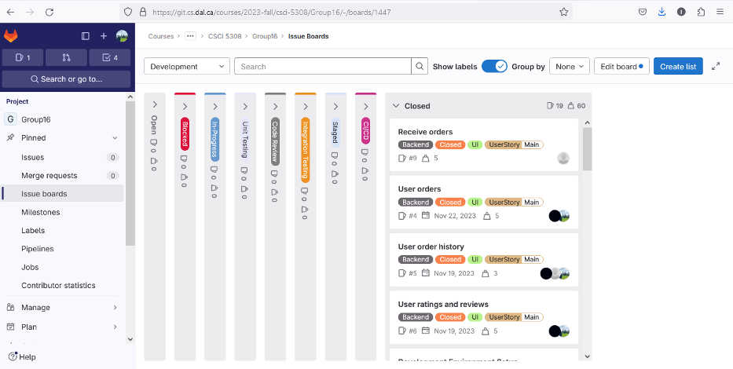
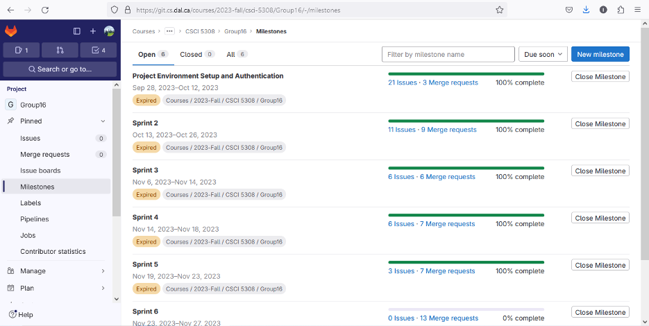
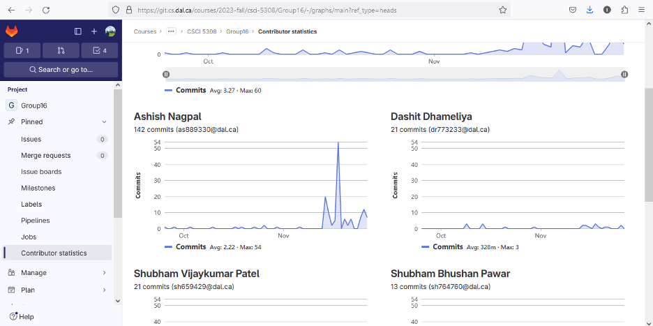
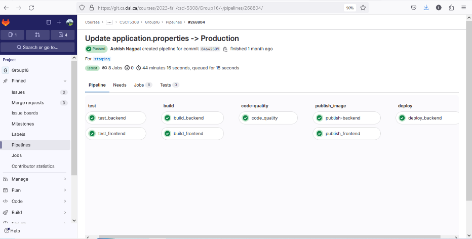
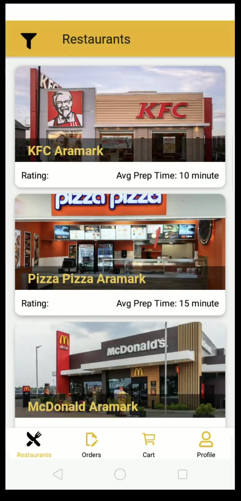
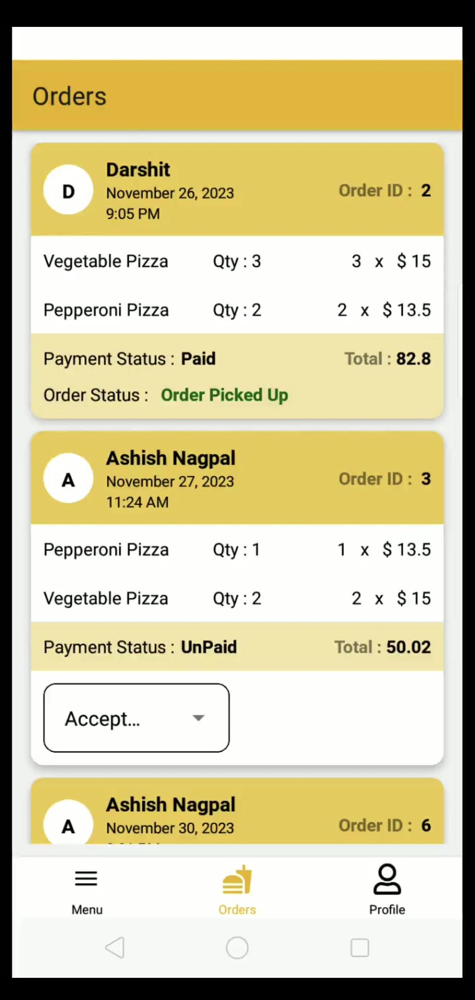

# DalBites- One stop destination for ordering food in Dalhousie Campus

## External Dependencies

External dependencies are software components or libraries that are required for this project to function properly. Please make sure to install the following dependencies before running the project.

For a comprehensive and up-to-date list of external dependencies, refer to the [**Dependencies Document**](Documentation/External_Dependencies.md).

## Build and Deployment

Ensure global accessibility by following our [**Build and Deployment Guide**](Documentation/Build_And_Deployment.md). This step-by-step guide covers everything from setting up your development environment to deploying your application, ensuring a smooth experience for users worldwide.

## User Scenarios

Check out the [**User Scenarios**](Documentation/User_Scenarios.md) document to discover all the cool things you can do with the application. It explains different ways users can interact with the app, making it easy to understand and use. Whether you're new and looking for guidance or experienced and seeking advanced features, this document is your go-to guide for getting the most out of the application.

## Contributions

### Overall

- Reviewed MRs of other team members and suggested changes as per the requirements.

- Integrated the application and tested to verifying the proper functionality 

### Backend
- I developed place order and review and rating API using Test-Driven Development (TDD) methodology in Spring Boot framework that adhere to the SOLID principles.

### Frontend
- Implemented user experience and user interface design principles such as typography, iconography, color-coding. 

### CI/CD
- Configured the entire gitlab ci/cd pipeline and deployed the application on server using gitlab runner.

  
*Figure 1: Issue Board*

  
*Figure 2: Milestones*

  
*Figure 3: Contribution Commits*

*Figure 4: CICD*

## Screenshots

*Figure 5: Restaurant List*

*Figure 6: Restaurant Side Order List*

*Figure 7: User side Order List*